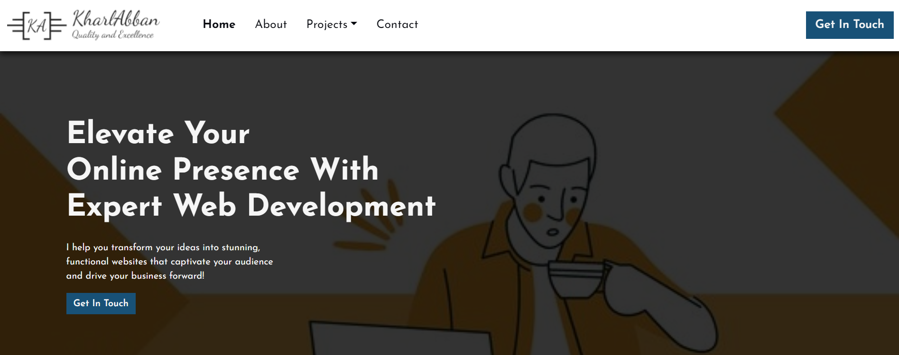

<!-- Cover Image -->

<!-- Heading and subtext -->
# Hey there! I'm Kharl 😁
Psst. Yeah, you. Don't leave without reacting.  
Skipping the long talk and just letting the cat outta the bag (if you know what I mean)

<!-- Social icons section -->

  
  &#8287;&#8287;&#8287;&#8287;&#8287;
  
  &#8287;&#8287;&#8287;&#8287;&#8287;
  
  &#8287;&#8287;&#8287;&#8287;&#8287;
  

 

<!-- Social badges section -->
<!-- View counter - https://github.com/DenverCoder1/Simple-View-Counter -->

 
  
  

 

<!-- Software and Tools -->
  
<h2>💼 My Tool Bag</h2>

  <!-- Some badges are from https://github.com/Ileriayo/markdown-badges -->

  <h4>👩‍💻 Programming Languages</h4>
  

      
      
      
      
      
      
      
      
      
  

  <h4>⚖️ Frameworks & Libraries</h4>
  

      
      
      
      
      
      
      
  

  <h4>🧊 Databases</h4>
  

      
      
      
      
      
      
  

  <h4>💻 Software and Tools</h4>
  

      
      
      
      
      
      
      
  

 

<!-- Start of Stats and Activity -->
  
<h2>📊 Stats and Activity</h2>

  <h3>🔥 Streaks</h3>

  <!-- GitHub Readme Streak Stats - https://github.com/DenverCoder1/github-readme-streak-stats -->
  

    <a href="https://github.com/DenverCoder1/github-readme-streak-stats">
      <!-- Use https://streak-stats.demolab.com or self-host with your own Vercel app - visit https://git.io/streak-stats for instructions -->
      
    </a>
    

  

  <h3>💻 GitHub Profile Statistics</h3>
  Yeah, I know its a long heading

  
  
   

  <b>Note:</b> Top languages is only a metric of the languages my public code consists of and doesn't reflect experience or skill level.

  

  <!-- End of Stats and Activity -->

  <!-- References Section -->
  Many thanks to the following devs for the support and design    
 https://github.com/DenverCoder1  
 https://github.com/forrestknight

  <!-- End of References Section -->